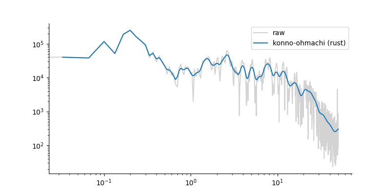

[](https://pypi.org/project/konnoohmachi/)
[](https://pypi.org/project/konnoohmachi/)
[](https://github.com/HerrMuellerluedenscheid/konnoohmachi/actions/workflows/python.yml)
[](https://github.com/HerrMuellerluedenscheid/konnoohmachi/actions/workflows/rust.yml)

Fast Konno-Ohmachi Spectral Smoothing
=====================================

Implemented in Rust with a Python interface. The performance gain measured against the widely used Python/numpy implementation that comes with [obspy](https://docs.obspy.org/packages/autogen/obspy.signal.konnoohmachismoothing.konno_ohmachi_smoothing.html#obspy.signal.konnoohmachismoothing.konno_ohmachi_smoothing) approaches approximately a factor of 2.5 for large and 10 for small vectors (see [Benchmarks](#Benchmarks)).



## Installation

Installation from [pypi](https://pypi.org/project/konnoohmachi/):

```bash
pip install konnoohmachi
```

Installation from source:

```bash
pip install .
```

## Usage

This smoothes some random numbers:

### Python

```python
import konnoohmachi

bandwidth = 40

# using fake random data
frequencies = np.arange(1000)
amplitudes = np.random.rand(1000)

smoothed_amplitudes = konnoohmachi.smooth(frequencies, amplitudes, bandwidth)
```

### Rust

```rust
use konnoohmachi;

let frequencies = Array1::<f64>::zeros(10);
let amplitudes = Array1::<f64>::ones(10);
let bandwidth = 40.0;
konnoohmachi_smooth(
    frequencies.view().into_dyn(),
    amplitudes.view().into_dyn(),
    bandwidth,
);
```

## Smoothing many spectra: `Smoother`

Building the smoothing windows is the expensive part of Konno-Ohmachi, and the windows depend only
on the frequency axis and the bandwidth -- never on the amplitudes. When several spectra share one
frequency axis, a `Smoother` builds the windows once and reuses them, which turns each subsequent
smoothing into a single matrix-vector product.

### Python

```python
import konnoohmachi

smoother = konnoohmachi.Smoother(frequencies, bandwidth)

for amplitudes in spectra:
    smoothed_amplitudes = smoother.smooth(amplitudes)
```

### Rust

```rust
use konnoohmachi::Smoother;

let smoother = Smoother::new(frequencies.view(), bandwidth);

for amplitudes in spectra {
    let smoothed = smoother.smooth(amplitudes.view());
}
```

The windows are cached as a dense `n x n` matrix of `float64`, so memory grows quadratically with
the length of the frequency axis -- about 8 MB at 1000 samples, but 8 GB at 32768. `smoother.nbytes`
reports the exact figure. For a one-off smoothing, or when the matrix would not fit in memory, use
`smooth` instead: it builds each window on the fly and needs only O(n) memory.

## Benchmarks

Measuring the execution time based of increasing sized spectra yields:

```
❯ python3 benchmark.py
nsamples |    Rust      |    Python     | Performance Gain
----------------------------------------------------------
256      |    0.00017   |    0.00192    |   11.30802
512      |    0.00054   |    0.00431    |    7.97596
1024     |    0.00198   |    0.01117    |    5.63623
2048     |    0.00775   |    0.03143    |    4.05371
4096     |    0.03067   |    0.10024    |    3.26844
8192     |    0.12212   |    0.35058    |    2.87080
16384    |    0.49391   |    1.29653    |    2.62506
32768    |    1.98499   |    5.05335    |    2.54578
```

### Window caching

Smoothing 20 spectra that share one frequency axis, comparing `smooth` against a reused `Smoother`
(`pytest tests/ --benchmark`):

```
nsamples |   uncached   |    cached     | Performance Gain
----------------------------------------------------------
256      |    0.01512   |    0.00098    |   15.42169
512      |    0.05470   |    0.00370    |   14.79167
1024     |    0.20750   |    0.01537    |   13.50033
2048     |    0.80200   |    0.06310    |   12.71000
```

The gain grows with the number of spectra and is bounded by their count: 20 spectra approach a 20x
ceiling, minus the one-off cost of building the windows. The Rust benchmarks (`cargo bench`) isolate
where the time goes -- at 4096 samples, building the windows takes ~174 ms while applying them takes
~3 ms, so the windows are roughly 58x more expensive than the smoothing they enable. A single
smoothing through a cold `Smoother` is ~3-8% slower than `smooth`, which is the price of writing the
matrix out; every reuse after that is nearly free.
